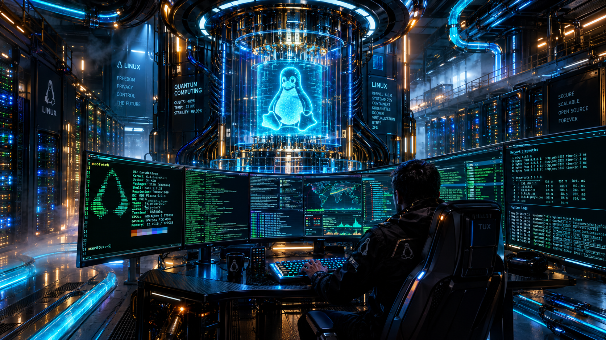

# Git a Vagrant – první Linux server



## Moje řešení

- **Distribuce a verze:** Debian13 - trixie
- **Použitý Vagrant box:** debian/trixie64
- **Adresář serveru:** srv01
- **Výsledek spuštění a přihlášení:** úspěšný
- **Případné problémy a jejich řešení:** -
- **Kontrolní kód a záznam ze serveru:** 
                **Kontrolní kód:** `SPOS-3I-9039acdf886c2ec72d11e7d01bf9ef3bb32ae5808b8705eb86f7a15d7aca56cc`
                ```text
                Úloha: git-vagrant / SPOŠ / 3. I / v1
                Distribuce: Debian GNU/Linux 13 (trixie)
                Hostname: debian13
                Kernel: 6.12.48+deb13-amd64
                Virtualizace: oracle
                Čas UTC: 2026-09-25T06:32:30Z
                Náhodné ID: 0e082d28-953f-415f-8e4c-10897f7be1ee
                ```
- **Bonus – AI obrázek a použitý prompt:** A highly detailed, cinematic wide-angle shot of a futuristic cyberpunk server room and command center. In the center, a large, glowing holographic Linux penguin Tux logo floats inside a massive quantum computer mainframe. Multiple curved glass monitors stream complex Linux terminal outputs, green and cyan bash code matrices, system logs, and network diagnostics in real-time. A tech operator in a dark, high-tech jacket is sitting in a sleek ergonomic chair, typing on a glowing mechanical keyboard, viewed from a slightly low angle behind the shoulder. The atmosphere is filled with subtle ambient fog, illuminated by dense rows of server racks with blinking blue, amber, and green LED indicator lights. Neon pipes filled with liquid cooling fluid snake along the floor and ceiling. Dramatic moody lighting with high contrast, photorealistic textures of brushed metal, carbon fiber, and glowing glass. Volumetric light rays piercing through the darkness, intricate cable management details, ultra-realistic, octane render, 8k resolution, Unreal Engine 5 aesthetic, cinematic composition, depth of field --ar 16:9